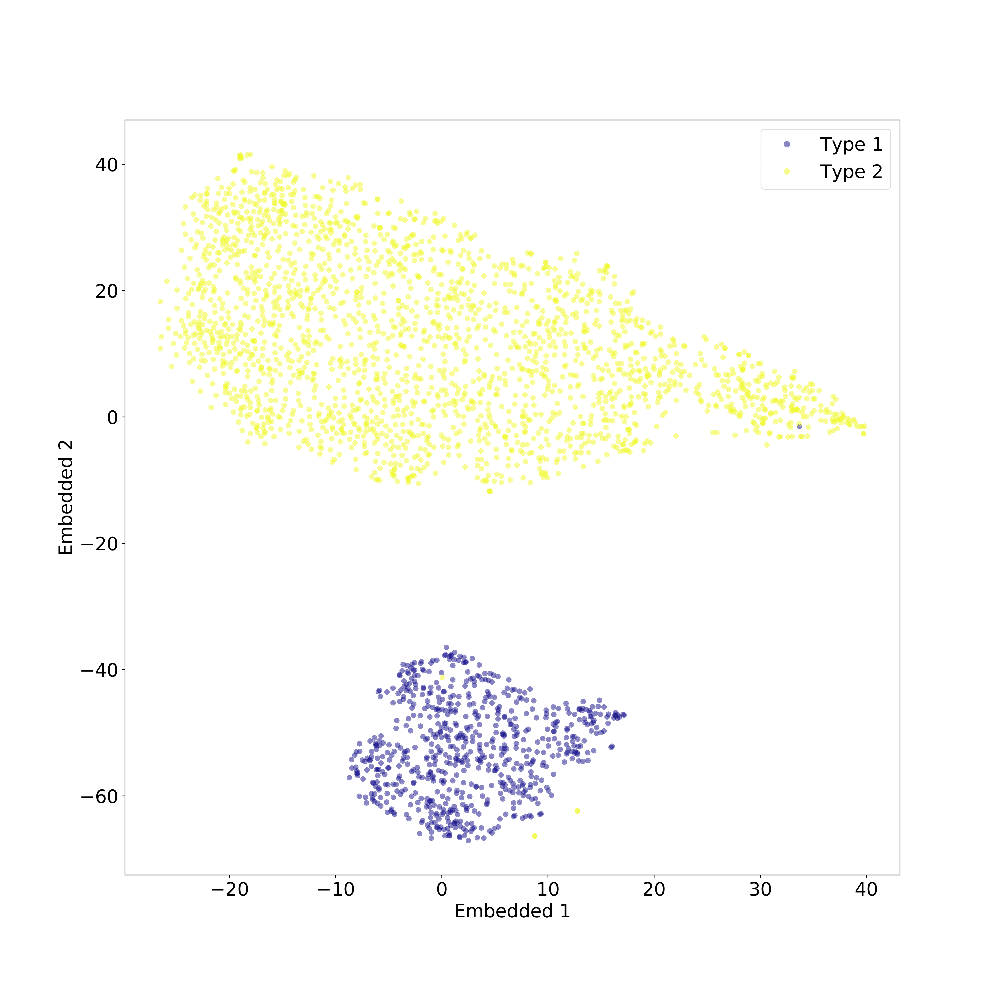
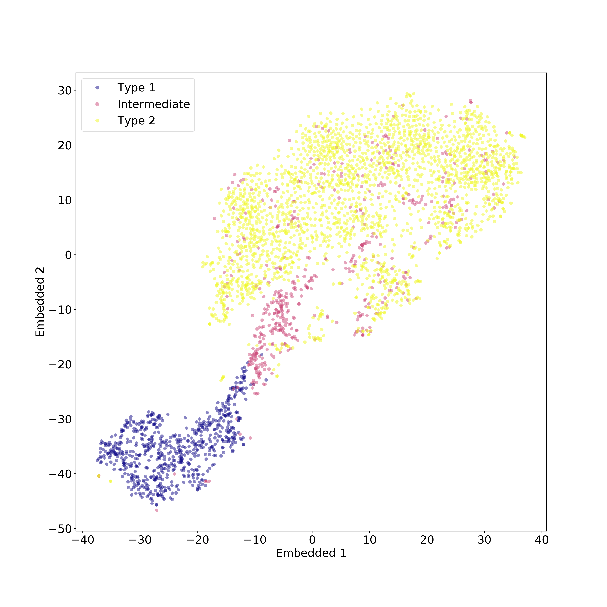
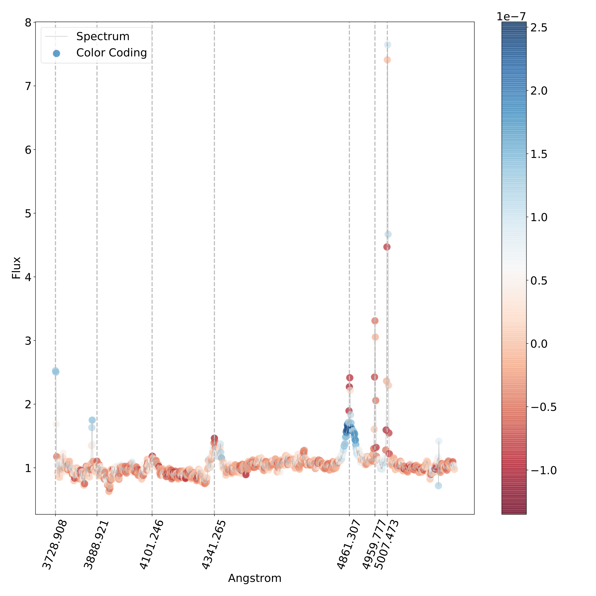

# Interpreting automatic AGN classifiers with saliency maps

Full code regarding my master thesis. The thesis project involved the automatic classification using machine learning (ML) algorithms of optical spectra of
Active Galactic Nuclei (AGN) and the interpretability of the black box result of the classification. A scientific article was published after this work: 
[Interpreting automatic AGN classifiers with saliency maps](https://doi.org/10.1051/0004-6361/202038911)

<h1>
  Introduction
</h1>

The dataset is composed by optical spectra of AGN. An Active Galactic Nuclues is a compact region at the center of a galaxy characterized by higher than normal
luminosity. An optical spectra is just an array of flux values at certain wavelengths in the optical part of the electromagnetic spectrum. In the context of this
work, the wavelength range of the spectra does not cover the whole optical range, due to the nature of the data.
An example of a spectrum used in this work can be seen in the following image:

Moreover the dataset is composed by three classes, called type 1, type2 and intermediate type.

<h1>
  Implementation Rundown
</h1>

The whole work is divided in four parts:

1. Data reduction:
in this step the whole dataset is corrected by redshift and normalized in flux. The dataset is also reduced to a wavelength range that includes all spectra in the
dataset and that is not too narrow.

2. Data Exploration:
in this step an unsupervised clustering algorithm is used to explore and visualize the dataset. The algorithm used is [t-distributed stochastic neighbor embedding](https://it.wikipedia.org/wiki/T-distributed_stochastic_neighbor_embedding). 
The algorithm was used with two classes (type 1 and type 2) and with the whole dataset. The results can be seen in the following images:

Type 1 vs Type 2             |  Type 1 vs Type 2 vs Intermediate type
:-------------------------:|:-------------------------:
  |  

3. Classification:
in this step a Support Vector Machine (SVM) was used to perform a two-class classification between type 1 and type 2 AGN, and a multi-class classification on the whole dataset (type 1, type2 and intermediate type AGN). In this step data are also scaled and mean normalized. A parameter optimization using GridSearch Cross-Validation 
is also performed. The best classifier turns out to be a linear kernel with C = 0.07.
The SVM reaches an F-score of 1.0 for the two class classification and an F-score of 0.942 (with 0.948 precision and 0.936 recall) for multi-class classification. 

4. Interpretability:
in this last step the SVM classification result is processed with an interpretability algorithm, called saiency map ([Deep Inside Convolutional Networks: Visualising Image Classification Models and Saliency Maps. Simonyan, K.](https://ui.adsabs.harvard.edu/link_gateway/2013arXiv1312.6034S/doi:10.48550/arXiv.1312.6034)). In the 
context of this work, saliency mapping consisted  in computing the gradient of the predicted class probability at a given spectrum. Regions of the spectrum were then color-coded based on the direction and the amount by which they influence the predicted class, effectively building a saliency map. The saliency map gives an intuiton
of which parts of a spectrum the SVM uses to classify it. The results suggest that the SVM uses features similar to the ones used by humans to classify AGN spectra,
such as specific spectral lines. An example of saliency map cna be seen below:

