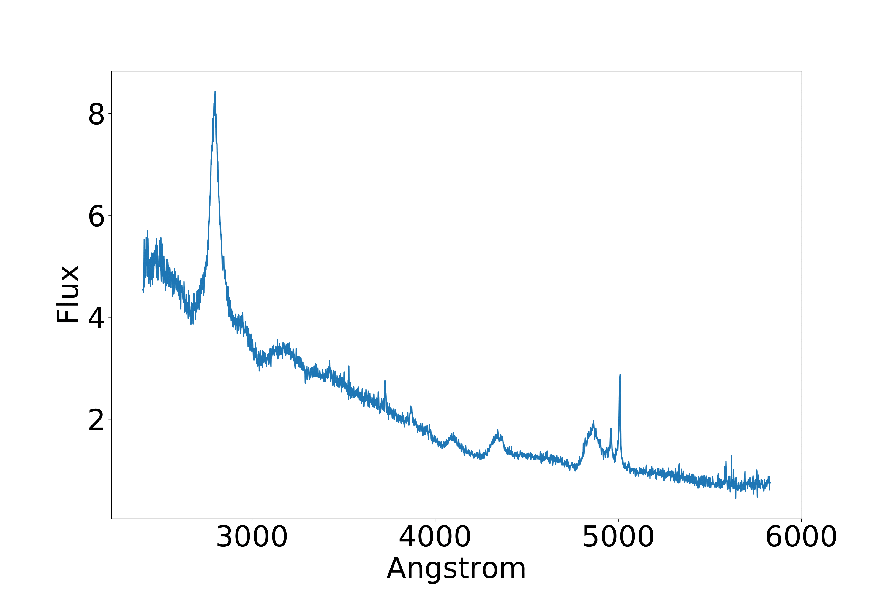

# Interpreting automatic AGN classifiers with saliency maps

Full code regarding my master thesis. The thesis project involved the automatic classification using machine learning (ML) algorithms of optical spectra of
Active Galactic Nuclei (AGN) and the interpretability of the black box result of the classification.

<h1>
  Introduction
</h1>

The dataset is composed by optical spectra of AGN. An Active Galactic Nuclues is a compact region at the center of a galaxy characterized by higher than normal
luminosity. An optical spectra is just an array of flux values at certain wavelengths in the optical part of the electromagnetic spectrum. In the context of this
work, the wavelength range of the spectra does not cover the whole optical range, due to the nature of the data.
An example of a spectrum used in this work can be seen in the following image:

Moreover the dataset is composed by three classes, called type 1, type2 and intermediate type.

<h1>
  Implementation Rundown
</h1>

The whole work is divided in three parts:

1. Data reduction:
in these step the whole dataset is corrected by redshift and normalized in flux
